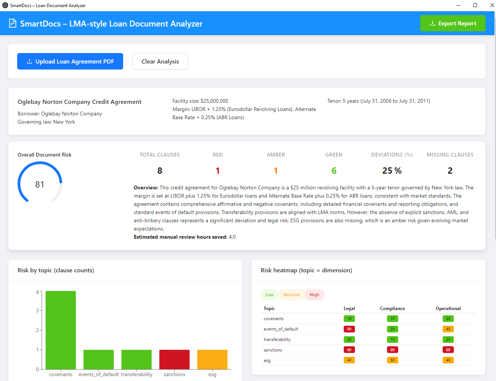
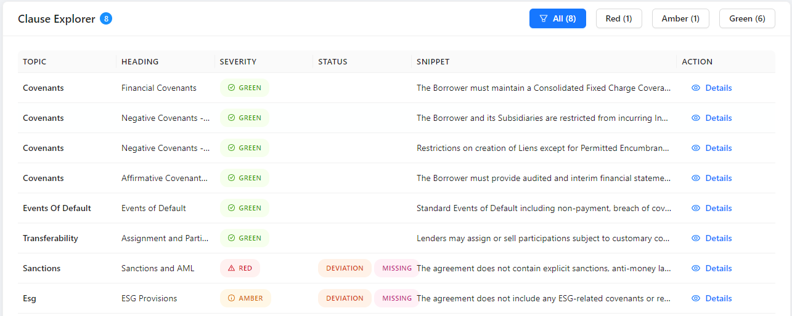
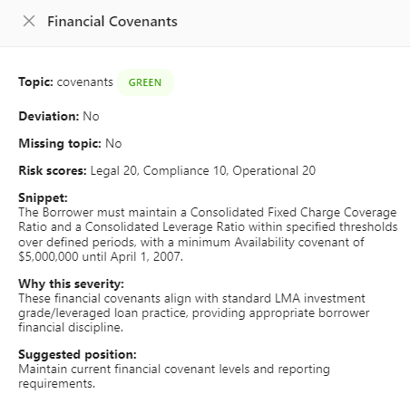

# SmartDocs – LMA-style Loan Document Analyzer

SmartDocs is an AI-powered desktop application for reviewing long, LMA-style loan agreements. It ingests PDF loan documents, extracts key deal terms, scores risk by topic, detects deviations from market-standard language, and presents everything in an underwriter-friendly dashboard.

## Overview

The project is a full-stack desktop application with web deployment capability:

- **Desktop Application**: Electron-based native app (Windows/Mac/Linux)
- **Frontend**: React + Vite SPA with professional UI components
- **Backend**: FastAPI service exposing a single `POST /analyze` endpoint
- **AI Engine**: OpenAI GPT-4 models for document understanding and risk assessment
- **Deployment**:
  - Desktop: Electron packaged application
  - Web Demo: [smartdocs-ai-analyzer.netlify.app](https://smartdocs-ai-analyzer.netlify.app)
  - Backend API: [smartdocs-backend.onrender.com](https://smartdocs-backend.onrender.com)

## Features

### Intelligent Document Processing
- Upload loan agreement PDFs and extract structured deal headers (borrower, facilities, governing law, margins, tenor, etc.)
- Smart PDF parsing handles documents up to 200+ pages

### Advanced Risk Analysis
- **Multi-dimensional risk scoring**: Each clause receives three independent scores:
  - Legal Risk (0-100): Contractual exposure assessment
  - Compliance Risk (0-100): Regulatory adherence evaluation  
  - Operational Risk (0-100): Execution challenge identification
- **Clause-level analysis** grouped by critical topics:
  - Covenants (financial, negative, affirmative)
  - Events of Default
  - Transferability and Assignment
  - Sanctions and AML
  - ESG Provisions
- **Severity labeling**: GREEN (standard), AMBER (review needed), RED (critical issues)
- **Market deviation detection**: Flags non-standard terms with DEVIATION and MISSING labels

### Interactive Analytics Dashboard
- **Overall document risk score** (0-100 scale)
- **Risk metrics breakdown**: Total clauses, RED/AMBER/GREEN counts, deviation percentage, missing clauses
- **Visual risk intelligence**:
  - Risk by Topic bar chart showing clause distribution
  - Risk Heatmap matrix displaying severity across Legal/Compliance/Operational dimensions
- **Interactive Clause Explorer**: Filterable table with expandable detail drawers showing:
  - Full text excerpts
  - AI-generated analysis rationale
  - Recommended positions for negotiation
  - Risk scores by dimension
- **Quantified value**: Estimated manual review hours saved (typically 4+ hours per document)

### Export & Reporting
- Generate comprehensive PDF reports for stakeholder distribution
- Audit trail for compliance documentation

### Desktop & Web Deployment
- Native desktop application for enhanced security and offline capability
- Web-based demo for quick access and testing

## Tech Stack

**Desktop Application**: Electron v31 (native Windows/Mac/Linux deployment)  
**Frontend**: React 18, Vite, Ant Design, Recharts, Axios  
**Backend**: FastAPI, Uvicorn, Pydantic, python-multipart  
**AI Engine**: OpenAI Python SDK (GPT-4)  
**Deployment**: Netlify (web frontend), Render (backend API)

## Project Structure

```
smartdocs/
├─ .git/
├─ .vscode/
├─ backend/
│  ├─ app.py              # FastAPI app + CORS + /analyze route
│  ├─ analyzer.py         # PDF + OpenAI analysis pipeline
│  ├─ models.py           # Pydantic models (AnalyzeResponse, etc.)
│  ├─ config.py           # Config values (e.g. BACKEND_PORT)
│  ├─ sample_docs/        # Local sample PDFs for testing
│  └─ requirements.txt    # Backend Python dependencies
├─ electron/
│  └─ ...                 # Electron configuration
├─ src/
│  ├─ components/
│  │  ├─ ClauseDetailDrawer.jsx
│  │  ├─ ClauseTable.jsx
│  │  ├─ DealHeader.jsx
│  │  ├─ HeatmapChart.jsx
│  │  ├─ RiskSummary.jsx
│  │  └─ TopicRiskChart.jsx
│  ├─ styles/
│  │  └─ globals.css
│  ├─ utils/
│  │  └─ exportReport.js
│  ├─ apiClient.js        # Axios client pointing to backend /analyze
│  ├─ App.jsx             # Root React component & main layout
│  ├─ main.jsx            # React/Vite entry point
│  ├─ index.html          # Vite HTML template
│  ├─ package.json        # Frontend deps & scripts
│  └─ package-lock.json
├─ images/                # Screenshots for documentation
│  ├─ dashboard-overview.png
│  ├─ clause-explorer.png
│  └─ clause-detail-full.png
├─ main.js                # Electron main process entry point
├─ preload.js             # Electron preload script for secure IPC
├─ node_modules/
├─ .env                   # Local env vars (not committed)
├─ .gitignore
├─ LICENSE
├─ package.json           # Root (Electron + orchestration) scripts
├─ package-lock.json
└─ README.md
```

## Package Scripts

**Root `package.json`** (Electron + orchestration):
- `dev:frontend` – Start Vite dev server
- `dev:electron` – Start Electron (waits for Vite)
- `dev` – Run both concurrently for desktop development
- `build` – Build frontend for production deployment

**`src/package.json`** (frontend):
- `dev` – Start Vite dev server
- `build` – Build production bundle
- `preview` – Preview production build

**`backend/requirements.txt`**:
```
fastapi
uvicorn[standard]
python-multipart
pydantic
openai
```

## How It Works (End-to-End Flow)

1. User uploads PDF in the React UI (web or desktop)
2. `src/apiClient.js` sends a multipart/form-data `POST` request to `/analyze` on the backend
3. FastAPI backend (`backend/app.py`):
   - Saves the uploaded file into `sample_docs/`
   - Calls `analyzer.analyze_document(file_path)`
4. Analyzer (`backend/analyzer.py`):
   - Reads the PDF and intelligently chunks content
   - Calls OpenAI GPT-4 using `OPENAI_API_KEY`
   - Extracts deal metadata (borrower, facilities, margins, tenor, governing law)
   - Analyzes each clause for topic, severity, and market deviations
   - Calculates multi-dimensional risk scores (Legal/Compliance/Operational)
   - Returns structured data conforming to `AnalyzeResponse`
5. Response is returned as JSON and deserialized on the frontend
6. React components update the dashboard: deal header, risk metrics, visualizations, clause table, and detail drawers

## Local Development

### Prerequisites

- Node.js (LTS) and npm
- Python 3.10+ and virtualenv (or Conda)
- OpenAI API key

### 1. Clone the repository

```bash
git clone https://github.com/Tomisin92/smartdocs.git
cd smartdocs
```

### 2. Backend setup (FastAPI)

```bash
cd backend

# Create & activate virtual environment
python -m venv smartdocenv
source smartdocenv/bin/activate  # Mac/Linux
# OR
smartdocenv\Scripts\activate     # Windows

# Install dependencies
pip install -r requirements.txt

# Export your OpenAI key
export OPENAI_API_KEY="sk-..."              # Mac/Linux
# OR
$env:OPENAI_API_KEY="sk-..."                # Windows PowerShell
```

Run the backend locally:

```bash
uvicorn app:app --reload --port 8000
```

- Docs at: http://127.0.0.1:8000/docs
- Health check: try `POST /analyze` with a small PDF

### 3. Frontend setup (web)

In another terminal:

```bash
cd smartdocs/src
npm install
npm run dev
```

App will be available at http://localhost:5173

For pure local development, set `API_BASE` in `src/apiClient.js`:

```javascript
const API_BASE = 'http://127.0.0.1:8000';
```

### 4. Desktop (Electron) Development

From the project root:

```bash
# Install root-level dependencies
npm install

# Option 1: Run everything with one command
npm run dev

# Option 2: Run in separate terminals
# Terminal 1
cd src
npm run dev

# Terminal 2 (wait for Vite to be ready)
cd ~/smartdocs
npx electron .
```

The Electron desktop window will open, displaying your SmartDocs app as a native application.

**What makes it desktop:**
- ✅ Standalone application window (not a browser tab)
- ✅ Native window controls (minimize, maximize, close)
- ✅ Desktop taskbar icon
- ✅ Offline-capable processing
- ✅ Enhanced security for sensitive documents

## Real-World Performance

**Example**: Oglebay Norton Company Credit Agreement

- **Document**: 150+ page LMA-style credit agreement
- **Processing Time**: ~1.5 minutes (vs. 4+ hours manual review)

### Analysis Dashboard


*Dashboard showing overall risk score (81/100), clause metrics, and dual visualizations (bar chart + heatmap)*

The analysis delivered:
- **8 clauses** identified across 5 key topics
- **1 RED flag**: Missing sanctions, AML, and anti-bribery clauses (Legal Risk: 100/100)
- **1 AMBER warning**: Missing ESG provisions (Medium compliance risk)
- **6 GREEN** standard clauses with appropriate structures
- **25% deviation rate** flagged for attention
- **2 critical missing clauses** identified
- **Time Saved**: 4.0 hours of manual review

### Interactive Clause Explorer


*Filterable table view showing all 8 clauses with topic categorization, severity levels, status labels, and text snippets*

Each clause can be expanded to reveal comprehensive details:



*Comprehensive detail view showing multi-dimensional risk scores (Legal/Compliance/Operational), full text excerpt, AI-generated analysis rationale, and recommended negotiation position*

**Key Features Demonstrated**:
- **Multi-dimensional risk scoring**: Legal Risk (20/100), Compliance Risk (10/100), Operational Risk (20/100)
- **Full text excerpts**: Complete clause content for context
- **AI analysis rationale**: Explains why the clause received its severity rating ("These financial covenants align with standard LMA investment grade/leveraged loan practice, providing appropriate borrower financial discipline")
- **Recommended positions**: Actionable guidance for negotiations ("Maintain current financial covenant levels and reporting requirements")
- **Status tracking**: STANDARD, DEVIATION, or MISSING labels for each clause

## Production Deployment

### Backend – Render

The FastAPI service is deployed as a Render Web Service:

- **Repository**: `Tomisin92/smartdocs`
- **Root Directory**: `backend`
- **Environment**: Python
- **Build Command**: `pip install -r requirements.txt`
- **Start Command**: `uvicorn app:app --host 0.0.0.0 --port $PORT`
- **Environment Variables** (Render → Settings → Environment):
  - `OPENAI_API_KEY` – your OpenAI key (no quotes)

Render exposes a public URL: https://smartdocs-backend.onrender.com

OpenAPI docs available at `/docs` and `/openapi.json`

### Frontend – Netlify

Netlify builds the React + Vite app:

- **Repo**: `Tomisin92/smartdocs`
- **Branch**: `main`
- **Build command**: `npm run build`
- **Publish directory**: `dist`

Netlify exposes the frontend at: https://smartdocs-ai-analyzer.netlify.app

The frontend's `src/apiClient.js` is configured to call the Render backend:

```javascript
const API_BASE = 'https://smartdocs-backend.onrender.com';
```

**Auto-deploy**: Whenever you push to `main`, Netlify auto-deploys the frontend and Render can be configured to auto-deploy the backend.

### Desktop Application Distribution (Optional)

To create distributable installers:

```bash
# Install electron-builder
npm install electron-builder --save-dev

# Add to package.json "scripts"
"package": "electron-builder"

# Build installers
npm run package
```

This creates platform-specific installers:
- Windows: `.exe` installer
- macOS: `.dmg` installer  
- Linux: `.AppImage` or `.deb`

## Typical Development Workflow

1. **Code locally**:
   - Update backend logic in `backend/analyzer.py`, models in `backend/models.py`, or routes in `backend/app.py`
   - Update frontend UI/UX in `src/components`, layout in `App.jsx`, or API wiring in `src/apiClient.js`
   - Test desktop features in Electron

2. **Run locally**:
   - Backend: `uvicorn app:app --reload --port 8000` from `backend/`
   - Frontend: `npm run dev` from `src/`
   - Desktop: `npm run dev` from root (runs both Vite + Electron)

3. **Commit and push**:
   ```bash
   git add .
   git commit -m "Describe feature or fix"
   git push origin main
   ```

4. **Deployment**:
   - Netlify picks up the push and rebuilds the SPA
   - Render (if auto-deploy is enabled) rebuilds and restarts the backend

5. **Verify**:
   - Test the Netlify URL with a sample PDF
   - Check Render Logs if any `/analyze` requests fail
   - Test desktop app locally before creating installers

## Environment Variables

### Backend (Render or local)

- `OPENAI_API_KEY` – **Required** for AI calls
- `BACKEND_PORT` (optional) – Via `config.py` to customize local port

### Frontend

Currently uses a hard-coded `API_BASE`. You can refactor to use Vite env vars:

```javascript
const API_BASE = import.meta.env.VITE_API_BASE_URL;
```

Then configure in `.env` or Netlify UI.

## Commercial Viability

### Value Proposition
- **Time Savings**: 94% reduction in document review time (4+ hours → ~1.5 minutes)
- **Cost Savings**: $200-400 per document at typical analyst rates
- **Risk Reduction**: Consistent, comprehensive analysis reduces missed clauses
- **Scalability**: Process high volumes during peak lending periods

### Revenue Model
- **SaaS Subscription**: $199-499/user/month
- **Enterprise Licensing**: Custom pricing for large institutions
- **ROI**: Breaks even after 10-15 documents per month

### Target Market
- 4,000+ US commercial banks
- 5,000+ credit unions  
- 10,000+ underwriters and credit analysts
- Legal and compliance teams

## Security & Compliance

- **Desktop-first architecture**: Keeps sensitive financial documents on-premise
- **No data retention**: Documents processed but not stored after analysis
- **Air-gapped deployment support**: Can run fully offline for maximum security
- **Audit trail**: Comprehensive logging for compliance documentation

## Known Limitations / Future Work

- **Authentication**: No user authentication; consider adding OAuth/SSO for enterprise deployment
- **File size limits**: Large PDFs (500+ pages) may increase processing time and API costs
- **Model configuration**: GPT model selection and prompts are hard-coded; consider making them configurable
- **Observability**: Add comprehensive logging, monitoring, and error tracking for production
- **Multi-language support**: Currently optimized for English LMA agreements
- **Integration**: API for connecting with loan origination systems

## Roadmap

- **Q1 2025**: Pilot program with 3-5 financial institutions
- **Q2 2025**: Enterprise features (user management, role-based access, audit logs)
- **Q3 2025**: Multi-language support (French, German loan agreements)
- **Q4 2025**: Direct integration with major loan origination platforms

## Running Tests (if/when added)

```bash
# Backend
cd backend
pytest

# Frontend
cd ../src
npm test
```

## Contributing

This is a hackathon project. For questions or collaboration inquiries, please open an issue on GitHub.

## License

See [LICENSE](LICENSE) file for details.

---

**Built with ❤️ for streamlining loan document review**

**Live Demo**: [smartdocs-ai-analyzer.netlify.app](https://smartdocs-ai-analyzer.netlify.app)  
**Repository**: [github.com/Tomisin92/smartdocs](https://github.com/Tomisin92/smartdocs)
